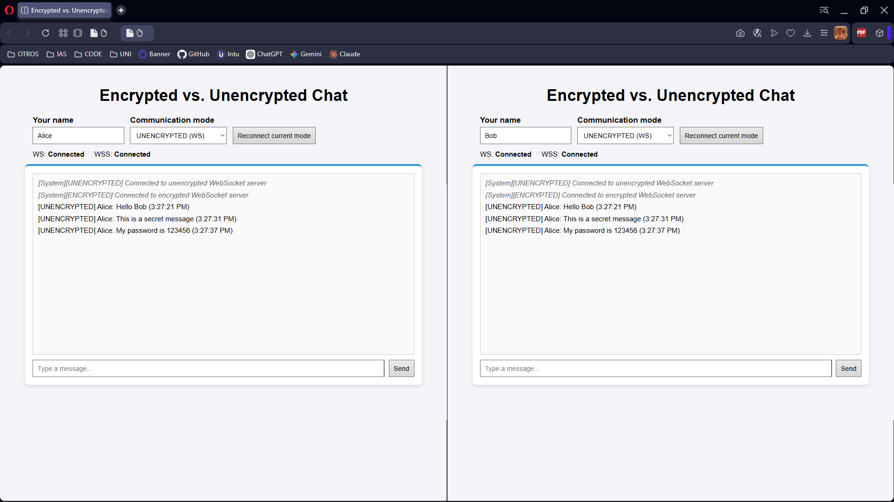
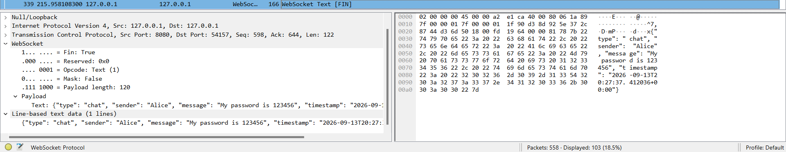
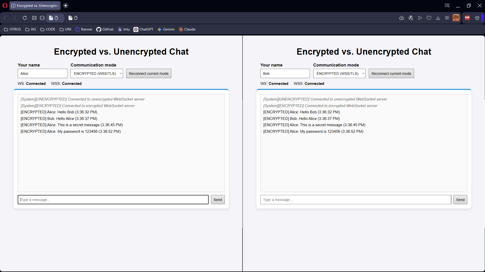
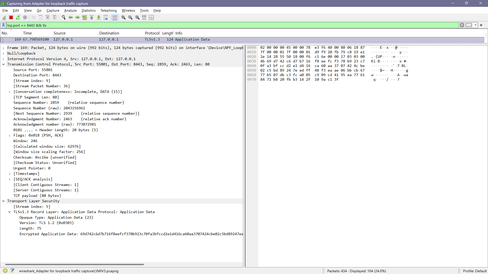
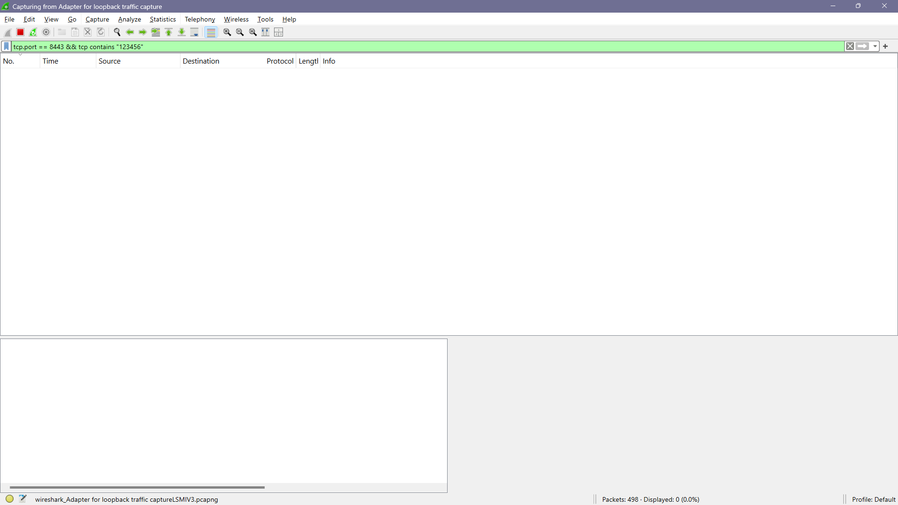
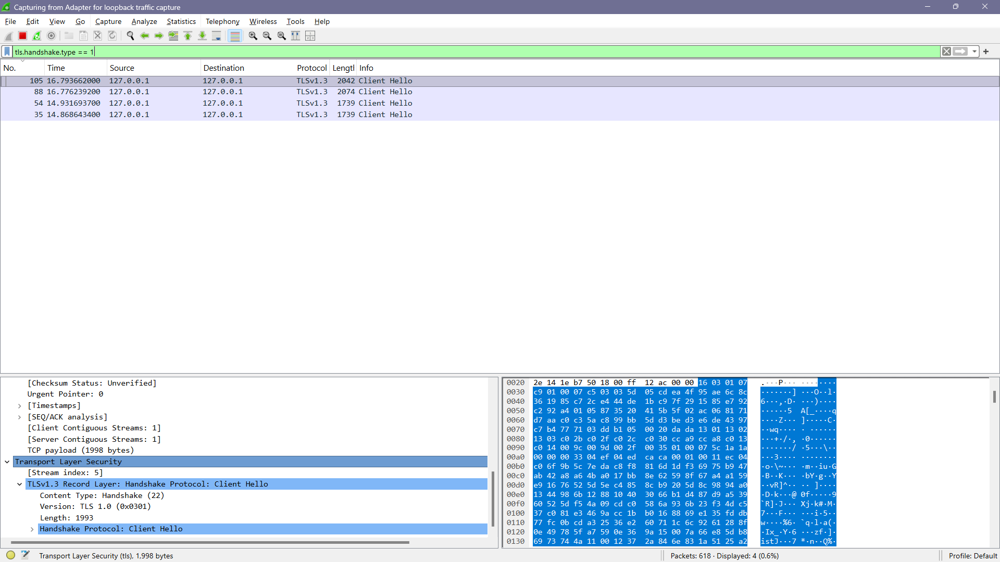
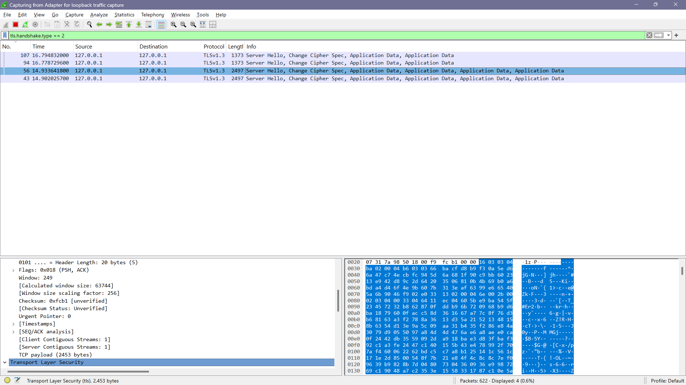

# Wireshark Test

## Objective

The goal of this test was to compare the same chat application using unencrypted WebSocket traffic and encrypted WSS/TLS traffic.

Both servers were running locally:

```text
WS:  ws://127.0.0.1:8080
WSS: wss://127.0.0.1:8443
```

Because the test was local, Wireshark captured traffic from the **Adapter for loopback traffic capture** interface.

## Test setup

The unencrypted backend was started in one terminal:

```bash
python backend/server.py
```

The encrypted backend was started in a second terminal:

```bash
python backend_encrypted/server.py
```

Two frontend windows were opened. One user was named `Alice` and the other `Bob`.

The same test messages were used in both modes:

```text
Hello Bob
This is a secret message
My password is 123456
```

## Unencrypted communication

Both clients first used `UNENCRYPTED (WS)`.

Alice sent the test messages and Bob received them correctly.



Wireshark was filtered with:

```text
tcp.port == 8080
```

and then with:

```text
websocket
```

The WebSocket payload was visible in plaintext. The captured packet showed the sender, the message, and the complete JSON content. For example, Wireshark displayed:

```text
"My password is 123456"
```



This confirmed that the chat worked, but the message content could be read directly from the network capture.

## Encrypted communication

Both clients were then changed to `ENCRYPTED (WSS/TLS)` and the same messages were sent again.

The chat continued working normally for Alice and Bob.



Wireshark was filtered with:

```text
tcp.port == 8443 && tls
```

The packets were identified as TLS traffic. Instead of the chat text, Wireshark showed **Application Data** and encrypted bytes.



A second filter was used to search for the same fictitious password inside the encrypted traffic:

```text
tcp.port == 8443 && tcp contains "123456"
```

The result was zero displayed packets.



The TLS connection setup was also captured. The `Client Hello` and `Server Hello` packets confirmed that a TLS session was established before the encrypted application data was exchanged.





## Cryptographic explanation

TLS uses a hybrid cryptographic model.

Asymmetric cryptography is used during the secure connection setup and server authentication. After the secure session is established, symmetric cryptography is used to protect the application data efficiently.

Wireshark can still see information such as the IP addresses, ports, packet sizes, and the fact that TLS is being used. However, the chat message itself is not directly readable in the encrypted capture.

## Conclusion

The test showed a clear difference between both modes.

With `WS`, the message content was visible in plaintext inside the WebSocket payload. With `WSS/TLS`, the application continued working in the same way, but Wireshark only showed encrypted TLS application data.

This demonstrates why encryption is important when confidential information is sent through a network.
